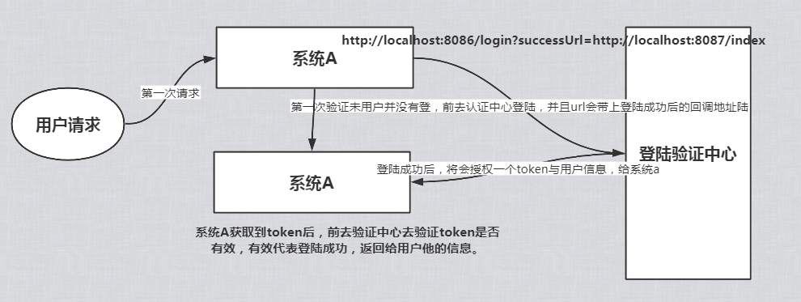

# metroplis

2020/4/8

需求更新：

* 权限模块

要求角色的新增，授权。

当新用户注册成功，要求赋予初始权限。


总规划为，后台管理系统（提供监控流量，用户管理，权限模块等）、游戏资讯网站（发帖，留言，等级制度）

`注：给用户使用的账号，统称为前台账号，管理者所使用的账号为后台账号`

----

### 后台管理系统需求

* ### 用户管理

  * **权限管理**
    * 后台账号为超级管理员或者管理员派发
    * 前台账号为用户在注册界面注册的账号，前台账号无法登陆后台系统，但是后台账号可以登录前台系统，且参与前台功能时，拥有特殊标记，例如`官方`之类
    * 为每个不同的模块授予角色，并分发给不同的账号，角色只能分发给后台账号，无法分发给前台账号
  * **账号管理**
    * 前台账号与后台账号分为两个功能
    * 无论是前台账号还是后台账号，可进行crud操作（受权限影响）和封禁处理（定义时间或者永久）
    * 支持excel批量导入和批量导出，只需要填写账号（account），用户名和密码可选择，默认值分别为，`人类`和`123`
  * 等待补充

- **子系统管理**
  - 对各个子系统的主题进行设置
- **发帖管理**
  - 可对发的贴进行审核，通过，或者打回
- **日志管理**
  - 对后台账号的操作进行监控，例如，对xxx设置了主题，通过了xxx的xxx发帖。拒绝了xxx，理由是。
- **首页的登录监控**
  - 会展示系统的用户活跃度，只要是注册和在线情况。天气预报，各个模块的使用情况。发帖情况，热门数据的收集等。
- **聊吧管理**
  - 对聊吧申请进行审核，通过后，申请者将拥有话题所有权。申请者有责任管理好话题中发言不正当用户。


* ### 前台系统

  * **个人主页**
    * 管理自己的发帖进度，历史发帖，虚拟货币，特殊勋章，等级之类
  * **聊吧**
    * 用户可自定义一个话题提交给后台进行审核，附上话题说明。通过后，用户可管理这个话题下发言的用户，并可开启聊天室进行在线讨论
    * 你也可以加入一个聊吧，如果聊主胡乱使用权利，可申请撤销吧主


----


### 单点登陆的技术总结

正常的单点登陆流程



主要要点在于token的加密解密的设计，还有session的共享问题，当你登陆成功后，你的session将会被填充用户数据，由于服务器将会持有每个会话的sessionId来保证会话彼此独立，所以你只需要能找到那个用于验证成功的会话即可。

##### 解决方案

token的加解密你可以利用java现成的工具进行，需要注意的是，token的解密后应该携带例如超时时间的信息，来保证与session生命周期一样。

session的共享问题可以通过存入第三方工具来实现每个系统之间的共享，你可以存入数据库，也可以存入redis，或者其他带有持久化机制的第三方服务就行，保证其它系统可以与他通信并且拿到想要的Session

##### Shiro的单点登陆总结

Shiro的引入将会接管Web服务的Session，例如Session的开启，关闭，超时还有持久化，你需要继承，`org.apache.shiro.session.mgt.eis`下的`AbstractSessionDAO`，来实现自己的Session持久化策略，默认Shiro的sessionid生成规则为UUID，本案例中，使用Redis来接管Session的持久化。

当你的子系统向验证中心请求的时候，就已经建立一个会话，并持久化到redis中，当你登陆完成时返回子系统主页的时候，就已经发现登陆成功，并且信息都已经查询出来，原因是Shiro已经将session的管理工作交给了redis，web端已经不再管理session的生命周期，当你的子系统请求发送过来时，cookies带着sessionId进入系统，系统中的shiro会去redis查询是否有这条session记录，存在即返回，所以一个用户将会只使用一个session来和各个系统中交流。退出的时候也会走之前我们定义好的踢出session的流程。

但是在开发过程中，发现退出和重新登录的时候，总会莫名的多一个session，经过反序列化我们知道这是一个请求favicon.ico的请求，需要在页面加入。

```html
<link rel="icon" href="data:image/ico;base64,aWNv">
```

来保证不会为这条请求创造额外的session。

如果你不希望在页面中增加这个，需要在即将进入SessionDao的时候，判断是否是请求icon的请求，并且将它挡下来。